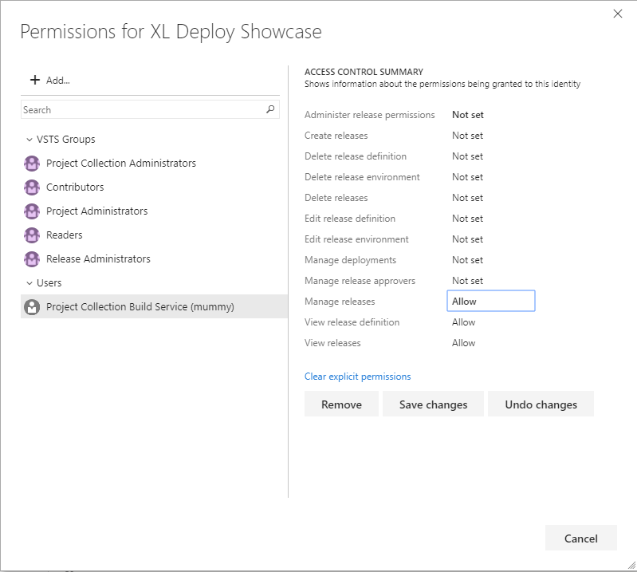

# Retain indefinitely current release

## Overview

As a common practice, after a successful release to production, often there is a need retain the involved artifact and relevant release information for certain amount of time. In order to avoid that a retention policy removes this information, you will mark that release with a Retain indefinitely flag, by choosing that option from the VSTS UI.
As this is a manual process, with this task I'm trying to automate this, in a form of task that can be used in your release, to set the Retain indefinitely flag for the running release.

### Requirements

The only requirement is that the account on which the build agent is running has sufficient privileges to set Retain indefinitely flag.
In case the permissions are missing, a similar error will be visible in the log

##[error]VS402904: Access denied: User Project Collection Build Service (mummy) does not have manage releases permission. Contact your release manager.

Edit the security settings for that particular release or for all the releases and set the following to the needed account.

Make sure 'Manage Releases' permission is granted for the indicated user.

### Parameters

Only a single parameter is presented by the task in a form of a checkbox labeled **Mark the current release to be retained indefinitely**. By default is set to true. If checked, it will mark the current release with Retain indefinitely flag. Otherwise it will take the Retain indefinitely flag off the current release.

## Release notes

* 2.0.4 - Node Js hanlder implementation [#1](https://github.com/mmajcica/retain-release/issues/1)
* 1.1.x - Initial implementation based on PS3 handler

## Contributing

Feel free to notify any issue in the issues section of this GitHub repository.
In order to build this task, you will need Node.js and gulp installed. Once cloned the repository, just run 'npm install' then 'gulp package' and in the newly created folder called _packages you will find a new version of the extension.